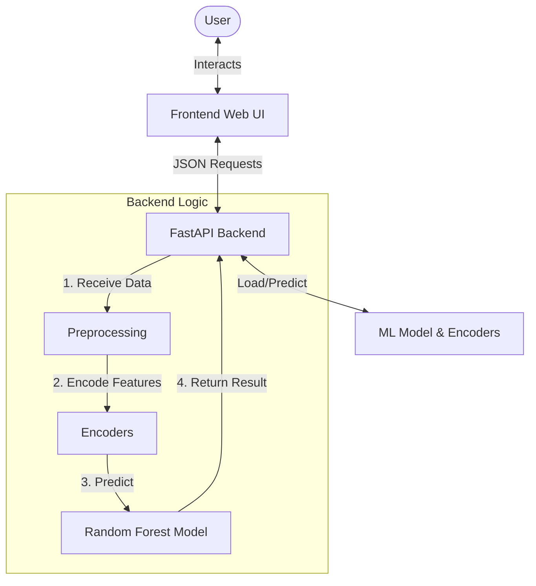
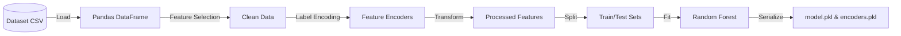
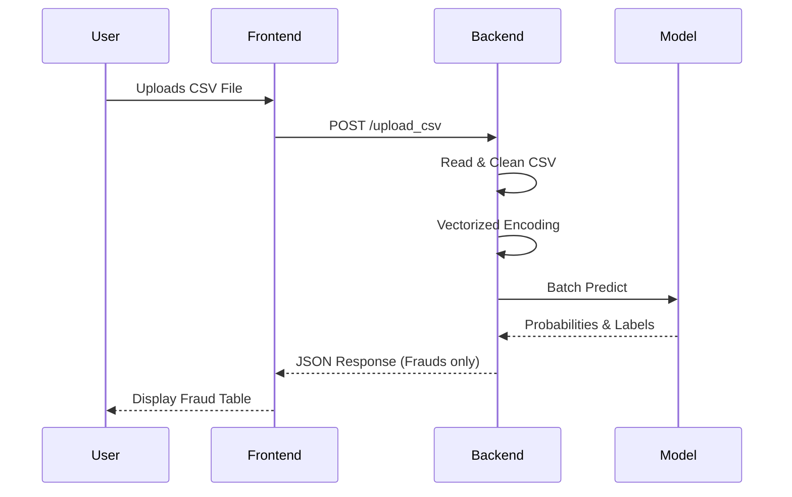
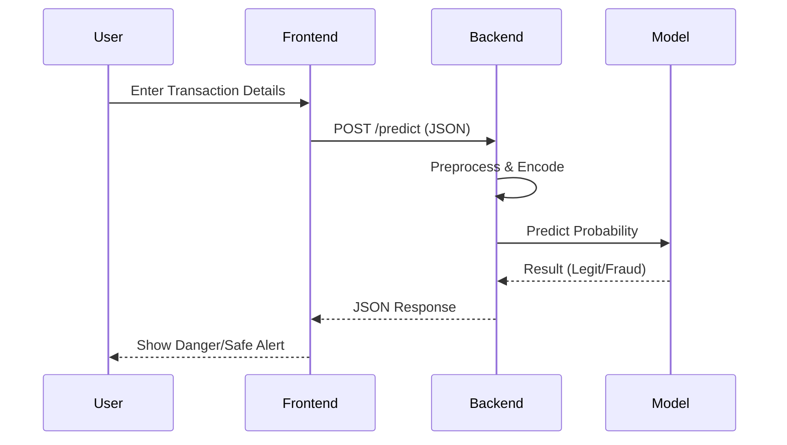

# 🛡️ UPI Fraud Transaction Detection System

A powerful Machine Learning-based web application to detect fraudulent UPI transactions in real-time. This system uses a **Random Forest Classifier** trained on transaction behaviors to identify potential fraud with high accuracy.


---

## 🏗️ System Architecture

The system follows a modern Client-Server architecture:
- **Frontend**: A responsive Web UI (HTML/CSS/JS) for user interaction.
- **Backend**: A high-performance FastAPI server.
- **ML Engine**: A trained Random Forest model with specialized encoders for categorical features.



### 🧠 Model Training Pipeline



---

## 🔄 Workflow

### 1. Batch Prediction (CSV Upload)
Perfect for analyzing large datasets of transactions at once.



### 2. Single Transaction Check
For real-time verification of individual transactions.



1. User enters details (Amount, Type, Bank, etc.).
2. System predicts **Legit** or **Fraud** instantly.
3. Displays a risk probability score (e.g., "98% Risk").

---

## 🚀 Features
- **Real-time Fraud Detection**: Instant analysis of single transactions.
- **Batch Processing**: Upload GBs of transaction logs (CSV) and get results in seconds.
- **High Accuracy**: Handles class imbalance using weighted Random Forest.
- **Premium UI**: Glassmorphism design with responsive tables and animations.
- **Smart Validation**: Automatically validates CSV headers and data types.

---

## 📂 Project Structure

```
upi_fraud_detection/
├── backend/
│   ├── main.py              # FastAPI Server & Logic
│   └── (Served Static Files)
├── frontend/
│   ├── index.html           # Web Interface
│   ├── style.css            # Premium Styling
│   └── script.js            # Frontend Logic (API Calls)
├── train_model.py           # ML Training Script
├── requirements.txt         # Dependencies
├── model.pkl                # Trained Model (Artifact)
├── encoders.pkl             # Feature Encoders (Artifact)
└── README.md                # Documentation
```

---

## 🛠️ Installation & Setup

### Prerequisites
- Python 3.8 or higher installed.

### 1. Clone the Repository
```bash
git clone https://github.com/Gitali7/UPI-FRAUD-TRANSACTION-DETECTION-USING-MACHINE-LEARNING.git
cd UPI-FRAUD-TRANSACTION-DETECTION-USING-MACHINE-LEARNING
```

### 2. Install Dependencies
```bash
pip install -r requirements.txt
```

### 3. Training the Model
(Optional if `model.pkl` is already present)
Ensure your dataset `upi_transactions_2024.csv` is in the root directory.
```bash
python train_model.py
```
*Wait for "Model saved as model.pkl"*

### 4. Run the Application
Navigate to the backend folder and start the server:
```bash
cd backend
uvicorn main:app --reload
```
The server will start at `http://127.0.0.1:8000`.

---

## 🎨 Usage

1. **Open Browser**: Go to [http://127.0.0.1:8000](http://127.0.0.1:8000).
2. **Batch Mode**:
   - Click "Batch Upload".
   - Drag & Drop your `transactions.csv`.
   - View the table of detected high-risk transactions.
3. **Single Mode**:
   - Switch to "Single Check".
   - Fill in the transaction details.
   - Click "Detect Fraud" to see the result.


